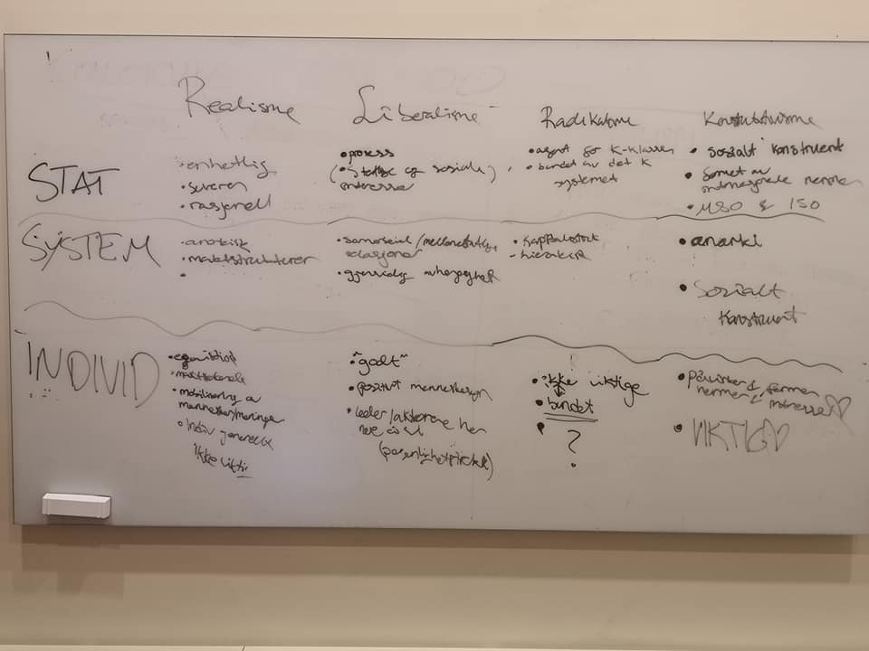

```{r setup, include=FALSE}
knitr::opts_chunk$set(echo = TRUE)
```

# Velkommen til siste gang :(

- Fokuset i dag ligger på (forhåpentligvis) nyttige tips

[[NOE RELEVANT BILDE HER]]

# Plan for i dag

- Bekymringer, forventninger, store spørsmål
- Vurderinger i STV, hva er de?
- Forberede seg til eksamen
  - Polya, Heuristisk problemløsning
  - Learning devices
- Gjennomføre en eksamen
  - Med eksempler fra mine egne STV1xxx eksamener

## Enda mer plan for i dag

- Akademisk skriving
- Semesteroppgaver
- Oppsummering av seminaraktiviteter
- Tårevått farvel (for nå)

# Bekymringer, forventninger, store spørsmål

[[BILDE AV NOEN BEKYMRET]]

# Vurderinger i STV

- Universitetsvurderinger er veldig varierende
- På SV-fakultetet er det fokus på sluttvurderinger
- To former, Eksamen og semesteroppgave

## Eksamen

- 4 timer vanligvis på ISV, SOS har ofte 6 timers
- Som regel bestående av en kortsvarsdel og en langsvarsdel
- Kortsvar tester bredde, langsvar tester evne og dybde
- Finnes også muntlige eksamen, men sjeldent
- Fleste eksamener lar deg velge mellom oppgaver
  - Men ikke Raino

## Hjemmeeksamen 

- Går over flere dager 
- Gjerne mer anvendt fokus 
- Tilgang på pensum er ikke alltid så nyttig som man tror
- Krever kildeføring

## Semesteroppgave

- Lengre tekst som skal arbeides med over tid
  - Formelt sett, mer enn 10 dager
- Som regel en kontinuerlig prosess   

## Uansett form

Planlegg tid til å se over!!!!!!!!

# Forberede seg til eksamen


## Første skritt: Planlegg

- Finn et godt startpunkt 
  - Minst 2 uker før eksamen
- Del opp pensum, gjerne etter forelesninger
- Leg en plan for når du skal lese hva

## Prioriteringer

- Ofte har man ikke tid/kapasitet til å lese alt
- Prøv å finne ut av hva det viktigste i emnet er
- Prioriter ting som dekker de tingene

## Selve lesing

- Notater, notater, notater
- 100 sider om dagen burde være et mål
- Bruk tekstens stil til alt den er verdt
  - Hvis forfatter skriver noe i kursiv, sikkert viktig
  - Bruk fremmedord også som knagger til å henge noe mer kunnskap på
  - Var dette ordet ukjent for meg når jeg startet?
- Fleste tilfeller: Bøker >>> Artikler 

## Rundt lesing

- Les sammen med andre
  - *1984*
- Strukturer lesesesjonen
  - 45 min lesing, 15 min pause, eks. 
  - Bruk pausen til å diskutere det du gikk leste
  
## Rundt lesing

- Kollokvieaktiviteter er nyttige
- Hjelper å få satt ord på ting du lurer på
- Det å konkretisere det er også hjelpsomt

## Kollokvier er gøy

```{r, echo=FALSE, out.width="90%"}
knitr::include_graphics("presImg/kollokvie1.jpg")
```

## Kollokvier er gøy

```{r, echo=FALSE, out.width="90%"}
knitr::include_graphics("presImg/kollokvie2.jpg")
```

## Kollokvier er gøy

```{r, echo=FALSE, out.width="90%"}

```

## Kollokvier er gøy

```{r, echo=FALSE, out.width="45%"}
knitr::include_graphics("presImg/kollokvie4.jpg")
```

## Kollokvier er gøy

- Ha minst et møte før eksamen
- Summer opp hovedpunkter fra alle forelesninger

## Mot slutten

- Sett av en dag eller to til helhetlig oversikt

# Gjennomføre en skoleeksamen

- Vi kan ta det fra starten 

## Dagen før

- Ikke sitt for lenge dagen før
- God søvn er det nyttigste du kan gjøre dagen før
- Tøm hodet for bekymringer 
- Mer New-Age saker, i dunno, mediter litt

## Selve dagen

- Pakk en god lunsj, litt snacks, noe å drikke
- Eksamene holdes i Silurveien 2
  - Planlegg godt med tid
- Merk hvilken sal du skal være i
  - Forskjellige innganger

## Hvor er dette?

- https://www.uio.no/om/finn-fram/omrader/andre/silurveien/

```{r, echo=FALSE}
knitr::include_graphics("presImg/silurveienveien.png")
```

## Selve dagen

- T-banen, linje 3, til Åsjordet
- Er en liten event i seg selv nesten
- Litt ventetid utenfor og innenfor når dere kommer dit
- Husk ID! 

## Rett før eksamen

- Hold deg rolig, ingenting mer du kan lære nå
- forbered sakene dine, lunsjen og alt
- Husk å ta frem litt skrivesaker

## Eksamen selv!

- Start med å lese gjennom alle oppgaver
  - (Ikke relevant i STV1010 riktignok)
- Noter ned nøkkelord til alle oppgavene
- De oppgavene du husker minst av ord til velger du bort
  - Eksempel fra egen eksamen
- Strukturer oppgaven
- Sentrer rundt nøkkelordene

## Eksamen selv!

- Husk at struktur er fortsatt viktig
  - Særlig for deg selv
- Gi deg tid til å se over

## Eksamen selv (1010 vers)

- Multiple choice blir litt annerledes
- 100 spørsmål
- Prøv å svare på spørsmålene uten å lese alternativene
- Eliminer det du vet det ikke er
- To timer beregnet, 20 min til å se over

# Akademisk Skriving

La oss snakke litt om hvordan man kan sikre at språket er godt når man leverer eksamen eller semesteroppgaver

## Akademisk Skriving

- Vokabular
- Struktur
- Klarhet
- Formalitet

## Vokabular

- Bruk det dere har lært aktivt
- Vis at dere kan det
- Sentrer oppgavebesvarelsen rundt fagbegrepene
<br> <br>


## Struktur

- Ha tydelige seksjoner 
- Et avsnitt skal ha egen struktur
- Introduksjon hjelper både deg og leser
- Samme med en oppsummering

## Klarhet

- Bruk et tydelig språk
- Vær litt bastant/selvsikker på formuleringene dine


## Formalitet

- Bruk et formelt språk
- Burde ikke være vanskelig
- Siter, om ikke formelt *riktig*

# Semesteroppgaver


# Oppsummering av seminaraktiviteter

- På begynnelsen av semesteret ba jeg dere si noe om forventninger til meg
<br> <br>
- Gruppe 12
  - Lett forståelig, språklig
  - Rom for spørsmål
  - Fokusere på det mest relevante
  - Tydeliggjøre innholdet
  - Lav terskel for spørsmål
  - Progresjonsorientering

## Oppsummering forts

- Gruppe 6
  - Tilgjengelighet
  - Gøye seminarer
  - Gi oppmerksomhet til det som merkes vanskelig
- Gruppe 8 
  - Interaktive seminarer
  - Lav terskel for spørsmål
  - Fokus på det viktige, forenkle, simplifisere
  - Tydelige beskjeder om forventninger
  
## Oppsummering forts

- Gruppe 14
  - Tett oppfølgning
  - Tips til hvordan forstå stoffet
  - Være forberedt
- Gruppe 10
  - Klarer å se pensum slik de gjør
  - Setter av tid til spørsmål i timen
  - Tilgjengelighet
  - Ta tak i feil tidlig
  
## Oppsummering forts

- Gruppe 10 forts.
  - Ta opp uoppforedret vanlige fallgruver
  - Møte forberedt
  - Klargjør innholdet i forelesning
- Gruppe 11
  - Tid til spørsmål
  - Rom for variasjon i forberedelse
  - Tydelig kommunikasjon
  - Klare forventninger
  - Tilrettelegg diskusjoner og faglig utveksling
  
# Til Neste Gang

- Det er ingen neste gang :(
- Med mindre vi ses i STV1020

```{r, include=FALSE}

Sys.setlocale("LC_ALL", "")
```

```{r}
obj <- c("Da ", "Kan ", "Vi ", "Ha ", "Det ", "Gøy ", "i ", "R!")

obj2 <- paste(obj, collapse = "")

print(obj2)

```

## Uansett

- Takk for følget
- Håper dere er fornøyde
- Lykke til på eksamen!!