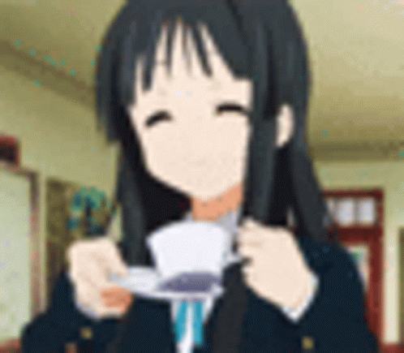
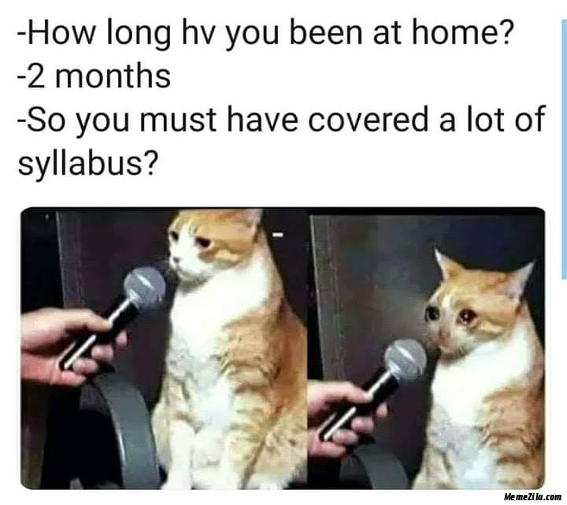
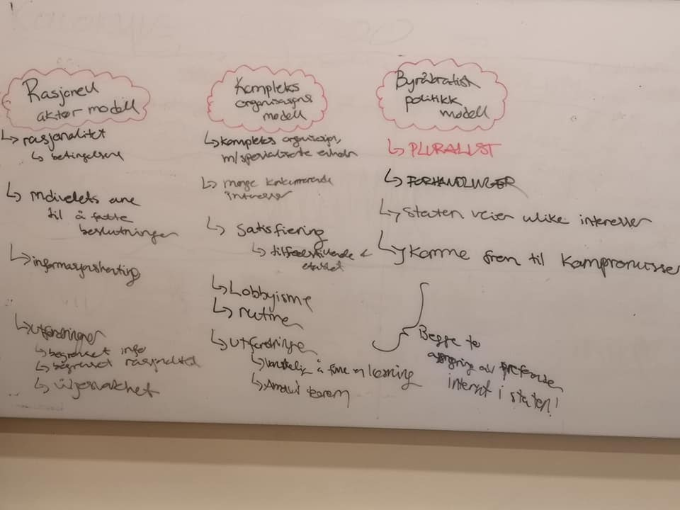
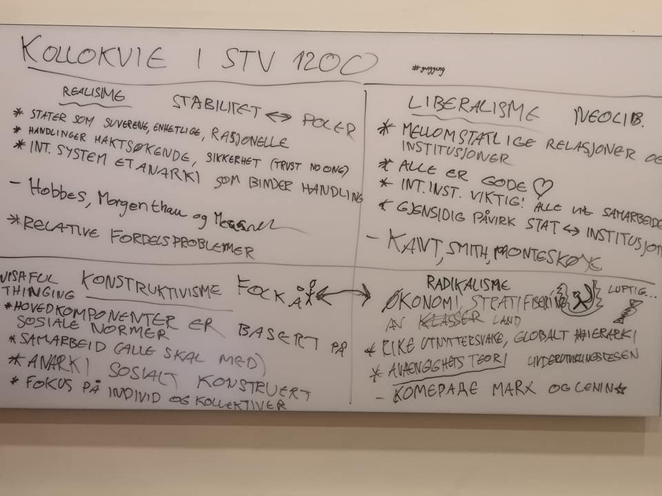
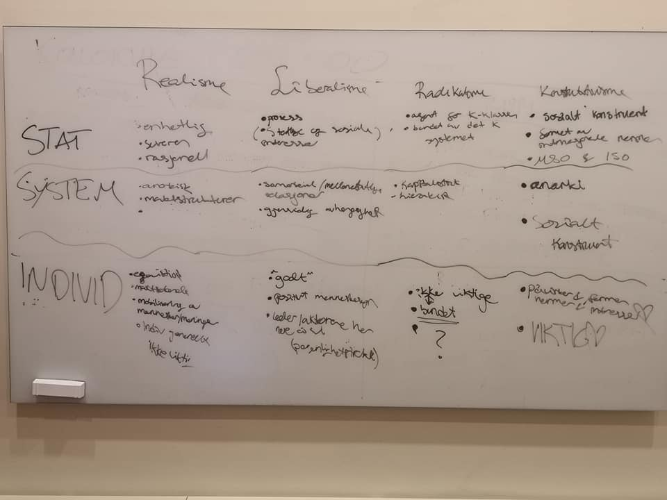
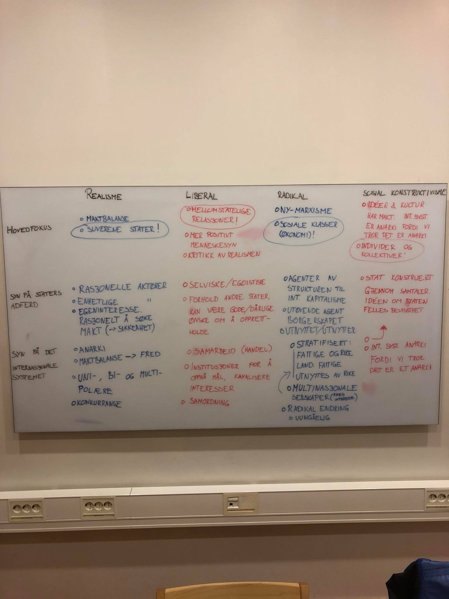
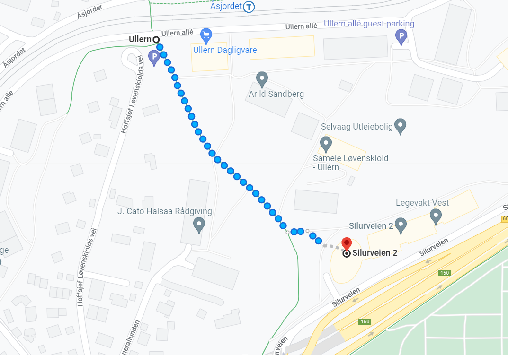

```{r setup, include=FALSE}
knitr::opts_chunk$set(echo = TRUE)
```

# Velkommen til siste gang :(

- Fokuset i dag ligger på (forhåpentligvis) nyttige tips


# Plan for i dag

- Bekymringer, forventninger, store spørsmål
- Vurderinger i STV, hva er de?
- Forberede seg til eksamen
  - Polya, Heuristisk problemløsning
  - Learning devices
- Gjennomføre en eksamen
  - Med eksempler fra mine egne STV1xxx eksamener

## Enda mer plan for i dag

- Akademisk skriving
- Semesteroppgaver
- Oppsummering av seminaraktiviteter
- Tårevått farvel (for nå)

# Bekymringer, forventninger, store spørsmål



## Frykt ei, det skal gå bra


## En liten runde

- Hva er deres største bekymringer/spørsmål rundt eksamen?

# Vurderinger i STV

- Universitetsvurderinger er veldig varierende
- På SV-fakultetet er det fokus på sluttvurderinger
- To former, Eksamen og semesteroppgave

## Eksamen

- 4 timer vanligvis på ISV, SOS har ofte 6 timers
- Som regel bestående av en kortsvarsdel og en langsvarsdel
- Kortsvar tester bredde, langsvar tester evne og dybde
- Finnes også muntlige eksamen, men sjeldent
- Fleste eksamener lar deg velge mellom oppgaver
  - Men ikke Raino

## Hjemmeeksamen 

- Går over flere dager 
- Gjerne mer anvendt fokus 
- Tilgang på pensum er ikke alltid så nyttig som man tror
- Krever kildeføring

## Semesteroppgave

- Lengre tekst som skal arbeides med over tid
  - Formelt sett, mer enn 10 dager
- Som regel en kontinuerlig prosess   

## Uansett form

Planlegg tid til å se over!!!!!!!!

# Forberede seg til eksamen



## Mine egne regler 

- Litt mer helhetlig rundt et emne
<br> <br>
- Les alt to ganger, minst. 
- Ha oversikt over hvor alt kommer fra
  - Hva er emnets "samlingspunkt(er)"
  - Metodologi? Forskningsdesign? Hvordan stater forholder seg til hverandre? Forvaltning?
- Vit nok til å kunne si noe om alt
  - Kunne si noe om:
  - Etnografi, analyseenheter, filosofi, variabler, operasjonalisering

## Første skritt: Planlegg

- Finn et godt startpunkt 
  - Minst 2 uker før eksamen
- Del opp pensum, gjerne etter forelesninger
- Leg en plan for når du skal lese hva

## Prioriteringer

- Ofte har man ikke tid/kapasitet til å lese alt
- Prøv å finne ut av hva det viktigste i emnet er
- Prioriter ting som dekker de tingene

## Selve lesing

- Notater, notater, notater
- 100 sider om dagen burde være et mål
- Bruk tekstens stil til alt den er verdt
  - Hvis forfatter skriver noe i kursiv, sikkert viktig
  - Bruk fremmedord også som knagger til å henge noe mer kunnskap på
  - Var dette ordet ukjent for meg når jeg startet?
- Fleste tilfeller: Bøker >>> Artikler 

## Rundt lesing

- Les sammen med andre
  - *1984*
- Strukturer lesesesjonen
  - 45 min lesing, 15 min pause, eks. 
  - Bruk pausen til å diskutere det du gikk leste

## Learning devices

- Devices menes her som mentale konstruksjoner 
- Så enkelt som tankekart
- Nodalpunkter, Hierarkiske diagramer
- Alle er ting som hjelper organisere informasjon
  - Gjør det lettere å se sammenheng mellom info og tema

## Rundt lesing

- Kollokvieaktiviteter er nyttige
- Hjelper å få satt ord på ting du lurer på
- Det å konkretisere det er også hjelpsomt

## Kollokvier er gøy

```{r, echo=FALSE, out.width="85%"}

```

## Kollokvier er gøy

```{r, echo=FALSE, out.width="85%"}

```

## Kollokvier er gøy

```{r, echo=FALSE, out.width="85%"}

```

## Kollokvier er gøy

```{r, echo=FALSE, out.width="45%"}

```

## Kollokvier er gøy

- Ha minst et møte før eksamen
- Summer opp hovedpunkter fra alle forelesninger
- Finn en struktur på kollokvier som funker
  - Vi pleide å gå gjennom forelesninger
  - Skrive viktige momenter på tavle
  - Slå opp i boka for hver slide

## Mot slutten

- Sett av en dag eller to til helhetlig oversikt
- Bruk dagen ofte til kollokvier, men litt tid til lesing
- Gå gjennom pensumlista, er jeg kjent med alt her?
- Gå gjennom forelesningsnotatene
  - Ta en titt på kvalifiseringsoppgavene også
- Hent ut spesifikke ting, unngå intens lesing

## Heuristikk

- Fancy ord for måter å løse et problem på
- Hvordan lærer jeg best, er et problem

## Polya

1. Understand the problem
2. Make a plan to solve it
3. Carry out the plan
4. Having solved it, look back and analyze how you went about it

## Polya fort.

- Jeg vil vite hvordan jeg lærer
1. Jeg har mange forskjellige redskap tilgjengelig for å lære
2. En plan ~ Kanskje teste forskjellige metoder på forskjellige ting
3. Gjør det
4. Gå tilbake å analyser hva som funket best, og forstå *hvorfor* det funket

## Polya

- Egentlig litt juksing... Polya var mer interessert i matte
  - Dette er egentlig litt meta-epistemologi
- Viktigste er at du tenker over hvordan du tillegner deg informasjon
  - Teknisk sett distinkt fra epistemologi

## Spørsmål

- Har dere noen flere spørsmål rundt det vi har snakket om?

```{r, echo=FALSE}
knitr::include_graphics("presImg/questiongif.gif")
```

# Gjennomføre en skoleeksamen 

- Vi kan ta det fra starten 

## Dagen før 

- Ikke sitt for lenge dagen før
- God søvn er det nyttigste du kan gjøre dagen før
- Tøm hodet for bekymringer 
- Mer New-Age saker, i dunno, mediter litt

## Selve dagen

- Pakk en god lunsj, litt snacks, noe å drikke
- Eksamene holdes i Silurveien 2
  - Planlegg godt med tid
- Merk hvilken sal du skal være i
  - Forskjellige innganger

## Hvor er dette?

- https://www.uio.no/om/finn-fram/omrader/andre/silurveien/

```{r, echo=FALSE}

```


## Selve dagen

- T-banen, linje 3, til Åsjordet
- Er en liten event i seg selv nesten
- Litt ventetid utenfor og innenfor når dere kommer dit
- Husk ID! 

## Rett før eksamen

- Hold deg rolig, ingenting mer du kan lære nå
- forbered sakene dine, lunsjen og alt
- Husk å ta frem litt skrivesaker

## Eksamen selv!

- Start med å lese gjennom alle oppgaver
  - (Ikke relevant i STV1010 riktignok)
- Noter ned nøkkelord til alle oppgavene
- De oppgavene du husker minst av ord til velger du bort
  - Eksempel fra egen eksamen
- Strukturer oppgaven
- Sentrer rundt nøkkelordene

## Eksamen selv!

- Husk at struktur er fortsatt viktig
  - Særlig for deg selv
- Gi deg tid til å se over

## Eksamen selv (1010 vers)

- Multiple choice blir litt annerledes
- 100 spørsmål
- Prøv å svare på spørsmålene uten å lese alternativene
- Eliminer det du vet det ikke er
- To timer beregnet, 20 min til å se over

## La oss ta en titt på noen eksempler

- STV1100 - H17
- STV1400 - H17
- STV1300 - V18
- STV1200 - H18

## Hjemmeeksamen

- Mye av det samme
<br> <br>
- Les instruksen ***nøye***
- Start med å tenke nøye på oppgaven
  - Ta deg gjerne en gåtur
- Begynn med nøkkelord, gjerne i en struktur
  - Hva er relevant pensum?
  - Proto-disposisjon
- Som alltid: gi deg selv tid til revisjon

## Planlegg!!

```{r, echo=FALSE}
examtable <- data.frame(Blokk = c("19. AM", "19. PM", "19. Kveld", "20. AM", "20. PM", "20. Kveld", "21. AM", "21. PM", "21. Kveld", "22. AM?"),
                        Aktivitet = c("Disposisjon, Brainstorming", "Begynn skriving", "Ferdig intro", "Hoveddel", "Hoveddel", "Hoveddel/avslutning", "Dobbeltsjekk intro/hoveddel", "Revisjoner", "Revisjoner", "?"),
                        Husk = c("Hva må jeg lese?", "Hvilke begreper skal med?", "Har jeg definert de viktigste begrepene?", "Svarer jeg på spørsmålet?", "Bruker jeg tydelig språk?", "Hva er svaret mitt egentlig?", "Har jeg definert alt godt?", "Har jeg brukt pensum godt?", "Er kildene riktig formattert?", "Er jeg fornøyd?"))

knitr::kable(examtable, format = "html")
```


## Spørsmål

- Har dere noen flere spørsmål rundt det vi har snakket om?

```{r, echo=FALSE}
knitr::include_graphics("presImg/questiongif.gif")
```

# Akademisk Skriving

La oss snakke litt om hvordan man kan sikre at språket er godt når man leverer eksamen eller semesteroppgaver

## Akademisk Skriving

- Vokabular
- Struktur
- Klarhet
- Formalitet

## Vokabular

- Bruk det dere har lært aktivt
- Vis at dere kan det
- Sentrer oppgavebesvarelsen rundt fagbegrepene
<br> <br>
- "Mangelen på andre stater i opplegget gjør at det er vanskelig å si om dette gjelder for andre stater, eller stater generelt"
- "Mangelen på andre stater i opplegget leder til lav ekstern validitet, dette er er problem når..."

## Struktur

- Ha tydelige seksjoner 
- Et avsnitt skal ha egen struktur
- Introduksjon hjelper både deg og leser
- Samme med en oppsummering

## Klarhet

- Bruk et tydelig språk
- Vær litt bastant/selvsikker på formuleringene dine
- Klargjør også begrepene så fort som mulig
<br> <br>
- "det kan hende at validitet på en måte har noe med hvor sikre vi er på svarene vi har fått"
- "Validitet handler i det store og det hele om at vi vet hva resultatene våre er"

## Formalitet

- Bruk et formelt språk
- Burde ikke være vanskelig
- Siter, om ikke formelt *riktig*
<br> <br>
- "I Celis og Erzeel på pensum, anvendes typisk casemetode, og dette eksempelet illusterer godt fordelene"

## Spørsmål

- Har dere noen flere spørsmål rundt det vi har snakket om?

```{r, echo=FALSE}
knitr::include_graphics("presImg/questiongif.gif")
```

# Semesteroppgaver

- Ikke i fokus her, men verdt å si noe om

## Planlegging

- Planlegg tidlig i prosessen når du vil være ferdig
- Sett av tid til å se over
- Avtal med en venn, utveksling av oppgaver
- Bruk seminarene for alt det er verdt (hvis relevant)

# Oppsummering av seminaraktiviteter

- På begynnelsen av semesteret ba jeg dere si noe om forventninger til meg
<br> <br>
- Gruppe 12
  - Lett forståelig, språklig
  - Rom for spørsmål
  - Fokusere på det mest relevante
  - Tydeliggjøre innholdet
  - Lav terskel for spørsmål
  - Progresjonsorientering

## Oppsummering forts

- Gruppe 6
  - Tilgjengelighet
  - Gøye seminarer
  - Gi oppmerksomhet til det som merkes vanskelig
- Gruppe 8 
  - Interaktive seminarer
  - Lav terskel for spørsmål
  - Fokus på det viktige, forenkle, simplifisere
  - Tydelige beskjeder om forventninger
  
## Oppsummering forts

- Gruppe 14
  - Tett oppfølgning
  - Tips til hvordan forstå stoffet
  - Være forberedt
- Gruppe 10
  - Klarer å se pensum slik de gjør
  - Setter av tid til spørsmål i timen
  - Tilgjengelighet
  - Ta tak i feil tidlig
  
## Oppsummering forts

- Gruppe 10 forts.
  - Ta opp uoppforedret vanlige fallgruver
  - Møte forberedt
  - Klargjør innholdet i forelesning
- Gruppe 11
  - Tid til spørsmål
  - Rom for variasjon i forberedelse
  - Tydelig kommunikasjon
  - Klare forventninger
  - Tilrettelegg diskusjoner og faglig utveksling
  
# Til Neste Gang

- Det er ingen neste gang :(

## Med mindre vi ses i STV1020

```{r, include=FALSE}

Sys.setlocale("LC_ALL", "")
```

```{r}
obj <- c("Da ", "Kan ", "Vi ", "Ha ", "Det ", "Gøy ", "i ", "R!")

obj2 <- paste(obj, collapse = "")

print(obj2)

knitr::include_graphics("presImg/R.jpg")

```

## Videre

- Jeg vil uansett være tilgjengelig på e-post
  - gardod@student.sv.uio.no 
  - eller på canvas
- Merk at jeg er i Canada fra 1.- 13. Desember
  - Mulig svar blir litt sene under den tida
- Kommer fortsatt til å være her litt i sent des
  - Har ikke noe liv vettu
  - Skal prøve å sjekke inn med folk hvis jeg ser dere

## Uansett

- Takk for følget
- Håper dere er fornøyde
- Lykke til på eksamen!!